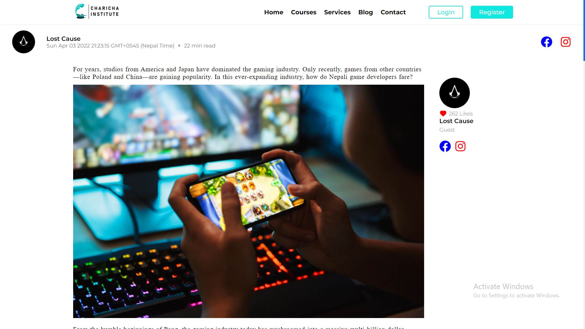

## Charicha Institute Official Website
Charicha Institute Official Website. Students Profiles, Blogs system, etc.

<p align="center">
	
</p>


## User Model 
```js
{ 
	firstName: type: String,
	lastName: type: String,
	profileURL: type: String,
	address: type: String,
	phoneNumber: type: Number,
	roles: [
		type: String,
		type: String,		
	],
	hearts: type: Number, 
	expPoints: type: Number,
	profileVisits: type: Number,
	courses: [
		"courseId": "111111111111111111111111011110110001101111111111111" (1: represents present, 0: represents absent)
		"courseId": "111111111111111111111111011110110001101111111111111" (1: represents present, 0: represents absent)		
	]
}
```
